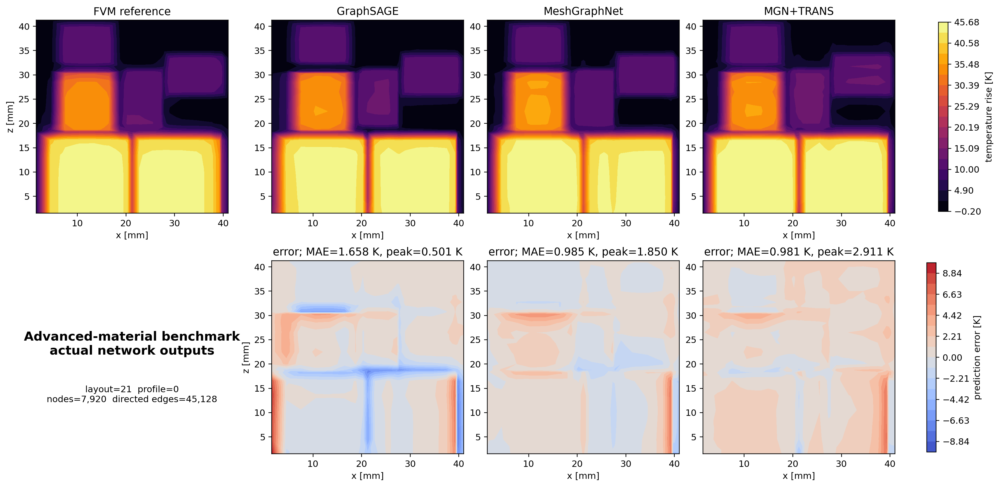
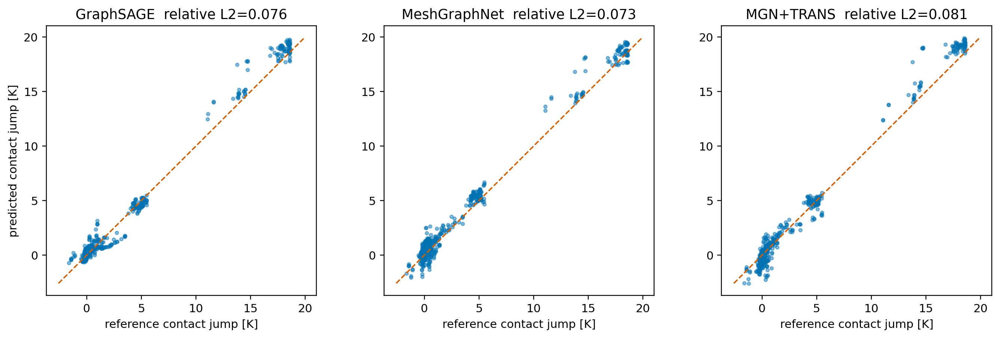

# ATPlace 高级材料物理：MGN+TRANS 端到端能力报告

更新日期：2026-09-17

## 结论

接触热阻、对角各向异性和温变导热率现在已经真正进入 GraphSAGE、MeshGraphNet 和 MGN+TRANS 的训练与评估链路。本文所有模型图均来自 checkpoint 的实际前向预测，不是 FVM 标签回放。

三种子平均结果显示，MGN+TRANS 在未见布局、跨网格和布局+网格联合测试中的全场 MAE及平均峰值误差均最低。相对 GraphSAGE，其 MAE 分别下降 32.2%、28.8% 和 29.2%。但 MeshGraphNet 在三套测试中的接触温跳相对 L2 均最低，说明全局注意力改善了温度场和热点，不会自动保证更准确的界面局部通量。

本轮材料参数在全部样本中固定，因此只能证明“高级物理条件下的布局/网格泛化”，不能证明跨材料泛化。

## 数据来源边界

本轮训练数据由项目内 Case1 高级 FVM 求解器生成，不是下载的 Multi-topology 数据：

- Case1 布局原型为 `derived_maxrects_v1`，属于项目派生布局；
- Multi-topology 本机目前只有 7 个代表 HDF5 样本；
- 该外部数据是 256×256 顶表面二维场，不包含三维四面体、材料界面面或体温度；
- 7 个样本只用于字段和适配器检查，未用于本报告训练，也没有被包装成有效 benchmark。

因此本报告证明的是“我们的 MGN+TRANS 已接上高级物理图”，并不代表已经接入完整外部数据集。

## 数据协议与 benchsize

| 数据集 | 图数 | 布局数 | 每图节点范围 | 每图有向边范围 | 每图接触面范围 |
| --- | ---: | ---: | ---: | ---: | ---: |
| train / medium | 72 | 18 | 4,560–6,072 | 25,664–34,340 | 760–1,012 |
| val / medium | 12 | 3 | 5,544–6,072 | 31,308–34,340 | 924–1,012 |
| test / medium | 12 | 3 | 5,040–6,072 | 28,416–34,340 | 840–1,012 |
| mesh-only / fine | 12 | 3 个已见布局 | 7,452–9,522 | 42,408–54,418 | 828–1,058 |
| layout+mesh / fine | 12 | 3 个未见布局 | 7,920–11,232 | 45,128–64,344 | 880–1,248 |

训练、验证和测试布局 ID 完全隔离。每个布局包含 4 个功率轮廓；总计 96 个独立中网格物理案例，另有 24 个与中网格物理工况配对的细网格评估图。

图契约为 32 维节点特征、7 维边特征，并保存显式接触面实体。三个模型使用相同数据、目标归一化、峰值损失、面积加权接触温跳损失和温变 Robin 能量投影。

## 模型与训练成本

训练设备：NVIDIA GeForce RTX 3060。种子：4107、4108、4109。

| 模型 | 参数量 | 训练时间/seed | 训练轮数 |
| --- | ---: | ---: | ---: |
| GraphSAGE | 20,737 | 33.5 ± 2.9 s | 60、60、57 |
| MeshGraphNet | 102,977 | 69.8 ± 0.5 s | 60、60、60 |
| MGN+TRANS | 142,819 | 89.3 ± 1.1 s | 60、60、60 |

模型结构：

```text
32-D cell features + 7-D face-edge features
                    │
        ┌───────────┼────────────────┐
        │           │                │
   GraphSAGE   MeshGraphNet   MeshGraphNet encoder
                                      │
                         sliced global attention
                                      │
                              MGN+TRANS decoder
        └───────────┬────────────────┘
                    │
       contact-jump loss + peak loss
                    │
   nonlinear k(T)-Robin energy projection
                    │
            predicted temperature rise
```

## 三种子结果

数值格式为均值 ± 样本标准差。界面指标为面积加权接触温跳相对 L2。

| 测试 | 模型 | 全场 MAE (K) | 峰值误差 (K) | 接触温跳相对 L2 | 能量相对误差 | 推理 ms/图 |
| --- | --- | ---: | ---: | ---: | ---: | ---: |
| 未见布局 / medium | GraphSAGE | 2.555 ± 0.031 | 1.120 ± 0.241 | 0.095 ± 0.005 | 4.32e-7 | 11.76 ± 0.42 |
|  | MeshGraphNet | 1.992 ± 0.023 | 0.879 ± 0.399 | **0.077 ± 0.011** | 4.43e-7 | 12.84 ± 0.33 |
|  | MGN+TRANS | **1.733 ± 0.311** | **0.847 ± 0.201** | 0.089 ± 0.015 | 4.64e-7 | 17.27 ± 0.13 |
| 已见布局 / fine | GraphSAGE | 2.347 ± 0.038 | 1.617 ± 0.492 | 0.113 ± 0.032 | 1.54e-6 | 12.52 ± 0.62 |
|  | MeshGraphNet | 2.084 ± 0.092 | 1.397 ± 0.310 | **0.088 ± 0.014** | 1.41e-6 | 14.21 ± 1.63 |
|  | MGN+TRANS | **1.672 ± 0.332** | **1.065 ± 0.407** | 0.100 ± 0.002 | 1.51e-6 | 21.21 ± 0.64 |
| 未见布局 / fine | GraphSAGE | 2.743 ± 0.033 | 2.095 ± 0.442 | 0.121 ± 0.024 | 1.13e-6 | 12.87 ± 1.12 |
|  | MeshGraphNet | 2.237 ± 0.063 | 1.294 ± 0.534 | **0.089 ± 0.011** | 1.13e-6 | 14.66 ± 0.66 |
|  | MGN+TRANS | **1.943 ± 0.263** | **1.143 ± 0.398** | 0.106 ± 0.005 | 1.14e-6 | 21.82 ± 0.33 |

能量误差为 (10^{-6}) 量级，而不是数学上的严格零，原因是温变 Robin 投影采用六次 float32 固定点更新。它已经比场误差低多个数量级，但后续可改用标量 Newton 求根将误差进一步压低。

## 真实网络预测云图

下图使用种子 4108、未见布局+细网格测试中的同一个物理案例。第一行是 FVM 标签和三个 checkpoint 的实际输出；第二行是同色标预测误差。图中的单案例排名不能代替上面的三种子总体统计。



该案例中，GraphSAGE、MeshGraphNet、MGN+TRANS 的全图 MAE 分别为 1.658、0.985、0.981 K。MGN+TRANS 的场 MAE最低，但本案例峰值误差不是最低，说明总体优势并非每个工况、每个指标都成立。

下图使用同一案例的接触面预测。虚线为理想预测：



该案例的接触温跳相对 L2 分别为 0.076、0.073、0.081，MeshGraphNet 最低，与三种子总体结论一致。

## 能力判断

已经得到支持的结论：

- MGN+TRANS 已经真正消费各向异性、温变和接触热阻图特征，并输出温度场；
- 在固定材料卡下，MGN+TRANS 的布局/网格联合全场泛化优于两个基线；
- 显式接触面监督有效，三个模型的温跳相对误差约为 8%–12%；
- MeshGraphNet 对局部界面量更稳定，MGN+TRANS 的优势主要在全局场和热点。

尚不支持的结论：

- 跨材料卡泛化；
- 非规则四面体几何泛化；
- 在完整 Multi-topology 或 IC-ThermBench 上优于公开基线；
- 温度场误差已达到工程替代 FEM 的精度。

## 复现

```powershell
# 生成高级物理训练与配对评估图
E:\Anaconda\python.exe src\generate_atplace_ml_dataset.py `
  --config configs\atplace_case1_contact_material_ml.yaml `
  --out data\atplace_case1_contact_material_ml

# 三模型、三种子训练
E:\Anaconda\python.exe src\train_atplace_ml.py `
  --data data\atplace_case1_contact_material_ml `
  --config configs\atplace_case1_contact_material_ml.yaml `
  --out outputs\atplace_case1_contact_material_ml `
  --models graphsage meshgraphnet mgn_transolver `
  --seeds 4107 4108 4109 --resume-existing

# 真实 checkpoint 预测图
E:\Anaconda\python.exe src\plot_atplace_advanced_predictions.py
```

机器可读结果：`outputs/atplace_case1_contact_material_ml/benchmark.json`。

后续已经在本数据上接入可重装配的温变/接触/Robin 离散算子、真实方程残差训练和非线性热启动修正。精度、速度以及 FVM/FEM 口径见 [ATPlace 非线性算子热启动报告](atplace_nonlinear_warm_start_report.md)。

## 下一步

下一条主线应分成两个互不混淆的实验：

1. 在当前求解器中采样独立材料卡和接触参数，并按整组材料卡划分 train/val/test，验证跨材料 OOD。
2. 若要使用 Multi-topology，先取得足量官方样本，再把 MGN+TRANS 改成二维像素/区域图版本；该数据不应被描述成三维四面体 benchmark。
