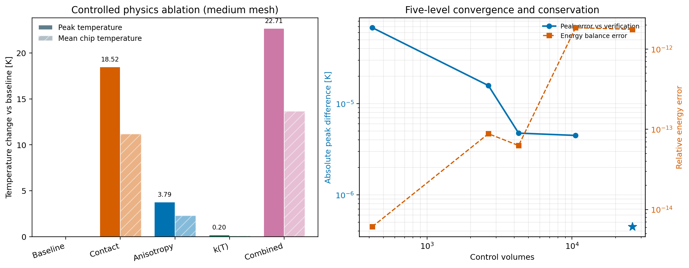
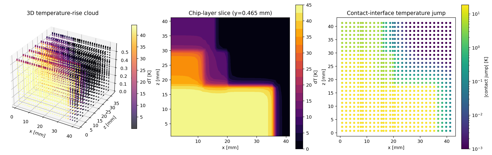

# ATPlace Case1：接触热阻、各向异性与温变材料实现报告

更新日期：2026-09-17

## 结论

第 3 阶段的物理链路已经完成，并通过网格收敛、守恒、最小值原理、图数据契约和非线性能量投影测试。当前实现不再把层间界面等价成普通节点边，而是显式保存接触面；材料同时支持对角各向异性导热张量和温度相关导热率。

在相同 Case1 几何、medium 网格、780 W 功率和 Robin 边界下，线性各向同性无接触基线的峰值温度为 **339.807 K**，加入全部三项物理后为 **362.517 K**。独立消融显示，本参数组中接触热阻是主效应（峰值增加 18.518 K），各向异性次之（增加 3.788 K），温变导热率单独增加 0.199 K；组合效应为 22.709 K。由此可见，忽略界面热阻会造成比网络架构差异更大的系统性标签偏差。

需要明确：这份报告验证了物理求解器和图契约正确，不等于已经证明跨材料泛化。当前参考图只有一个固定材料/接触参数组合，不能用于宣称材料 OOD 能力。

后续已完成三个模型、三个种子的端到端训练；真实 checkpoint 预测云图和统计见
[MGN+TRANS 端到端能力报告](atplace_advanced_mgn_transolver_report.md)。

## 图像结果

下图左侧给出独立物理项对峰值温度和芯粒平均温度的影响，右侧给出五级网格相对 verification 解的峰值差异及能量守恒误差。



下图依次为 verification 网格的三维温升点云、芯粒层 x-z 温升切片，以及显式接触面温跳分布。接触温跳采用对数色标，以同时显示热点附近的大温跳和低热流区域的小温跳。



## 物理离散

对相邻控制体 (a,b)，沿共享面的法向导热系数取对应的张量对角分量。含接触热阻的面导纳为：

\[
G_{ab}=\frac{A_f}{d_a/k_{a,n}+R''_{tc}+d_b/k_{b,n}}.
\]

其中 (R''_{tc}) 的单位为 \(\mathrm{m^2 K/W}\)。没有接触热阻的内部面令 (R''_{tc}=0)。顶部 Robin 面使用：

\[
G_{i,\mathrm{top}}(T)=
\frac{A_i}{d_i/k_{i,y}(T)+1/h}.
\]

材料温变模型为：

\[
k_{m,j}(T)=k_{m,j}^{ref}\,
\operatorname{clip}\left[1+\alpha_m(T-T_{ref}), f_{min}, f_{max}\right],
\quad j\in\{x,y,z\}.
\]

非线性系统采用松弛 Picard 迭代；本配置在五种网格上均用 18 次迭代达到 (10^{-7}) K 更新阈值。若所有温度系数为零，代码自动退化为一次线性求解。

当前示例参数：

- interposer–ubump：(R''_{tc}=5\times10^{-6}\ \mathrm{m^2K/W})
- chip–TIM：(R''_{tc}=2\times10^{-5}\ \mathrm{m^2K/W})
- C4、TSV、u-bump 和 TIM 使用不同的 (k_x,k_y,k_z) 倍率，最大各向异性比为 2.571
- chip silicon、chip underfill、TIM 的温度系数分别为 -0.0012、-0.0010、-0.0020 K⁻¹

这些数值是当前研究配置，不是经过实测标定的材料卡。用于论文结论前，应给出来源、测量不确定度和灵敏度范围。

## 受控物理消融

基准口径：Case1 固定布局、medium 网格、2,652 个控制体、14,750 条有向边、总功率 780 W。除表中开关外，几何、网格、功率、Robin 边界和基础材料常数完全相同。

| 方案 | 接触 | 各向异性 | 温变 | 峰值温度 (K) | 相对基线峰值变化 (K) | 芯粒平均温度变化 (K) | 迭代数 | 能量相对误差 |
| --- | ---: | ---: | ---: | ---: | ---: | ---: | ---: | ---: |
| 线性各向同性无接触 | 否 | 否 | 否 | 339.807 | 0.000 | 0.000 | 1 | 8.75e-15 |
| 仅接触热阻 | 是 | 否 | 否 | 358.326 | +18.518 | +11.183 | 1 | 5.51e-14 |
| 仅各向异性 | 否 | 是 | 否 | 343.595 | +3.788 | +2.301 | 1 | 1.25e-14 |
| 仅温变 | 否 | 否 | 是 | 340.006 | +0.199 | +0.090 | 18 | 1.12e-14 |
| 三项组合 | 是 | 是 | 是 | 362.517 | +22.709 | +13.681 | 18 | 8.82e-14 |

组合工况的最小导热率缩放因子为 0.9468；接触面平均绝对温跳为 4.451 K，最大绝对温跳为 18.518 K。组合增量不要求等于三个单项增量之和，因为温变导热率会与界面温跳及各向异性热流路径耦合。

机器可读结果位于 `outputs/atplace_case1_contact_material/physics_ablation.json`。

## 五级网格收敛与 benchsize

| 网格 | 控制体 | 有向边 | 接触面 | 求解时间 (s) | 峰值温度 (K) | 与前一级峰值差 (K) | 能量相对误差 |
| --- | ---: | ---: | ---: | ---: | ---: | ---: | ---: |
| coarse | 420 | 2,176 | 140 | 0.042 | 362.516433 | — | 6.12e-15 |
| medium | 2,652 | 14,750 | 442 | 0.705 | 362.516517 | 8.38e-5 | 8.82e-14 |
| fine | 4,284 | 24,112 | 476 | 2.158 | 362.516506 | 1.10e-5 | 6.28e-14 |
| reference | 10,584 | 60,606 | 882 | 23.462 | 362.516505 | 2.68e-7 | 1.85e-12 |
| verification | 26,040 | 150,964 | 1,736 | 194.964 | 362.516501 | 4.48e-6 | 1.76e-12 |

五级网格均满足 780 W 功率守恒和温度最小值原理，最终级相对前一级的最大芯粒平均温度变化为 0.138 K，小于配置中的 0.25 K 阈值。求解时间是本机单次运行的功能性记录，不是严格性能 benchmark；进程预热、线程和重复次数未按微基准锁定。

## 多实体图与 ML 契约

verification 图的 benchsize：

| 项目 | 数量 |
| --- | ---: |
| 节点 / 控制体 | 26,040 |
| 有向邻接边 | 150,964 |
| 显式接触面 | 1,736 |
| 顶部 Robin 面 | 868 |
| 节点特征 | 32 |
| 边特征 | 7 |

新增节点特征为 (\log k_x,\log k_y,\log k_z) 和温度系数；新增边特征为接触热阻及接触界面标记。图对象还保存：

- 参考温度和最终温度下的导热率张量；
- 参考算子和最终物理算子的边导纳、顶部 Robin 导纳；
- 接触面两侧单元索引、面积、热阻、热流和温跳；
- 顶部面积、半单元距离、对流系数和温变截断范围。

接触温跳损失使用

\[
\Delta T_{tc}=q''R''_{tc}=\frac{Q_f}{A_f}R''_{tc},
\]

并按接触面积加权。训练用目标与参考温度算子一致，避免把最终温度算子偷偷泄漏进输入；物理最终温跳另存用于诊断。

全局能量投影也已从线性常数平移升级为非线性边界投影：每次平移后重算 (k_y(T)) 和 Robin 面导纳，六次固定点更新后再输出温升。精确参考温度场回放得到 0 K 误差，预测散热为 779.999999999 W，能量相对误差为 1.76e-12。

## 验证范围

当前自动测试覆盖：

- 接触热阻会产生非零界面温跳并提高峰值温度；
- 对角各向异性特征和温度系数正确进入图；
- 温变 Picard 迭代收敛，线性材料只求解一次；
- 参考场通过动态 Robin 算子得到同一能量平衡；
- GraphSAGE、MeshGraphNet、MGN+TRANS 使用同一能量投影；
- 单图和 PyG 批图的接触面损失契约一致。

完整测试命令为：

```powershell
E:\Anaconda\python.exe -m pytest tests -q
```

本次执行结果：**76 passed in 5.57 s**，无失败、跳过或预期外警告。

## 复现

```powershell
# 1. 五级物理收敛
python src/atplace_six_layer_fvm.py `
  --config configs/atplace_case1_contact_material.yaml `
  --out data/atplace_case1_contact_material

# 2. 五组独立物理消融
python src/evaluate_atplace_material_physics.py `
  --config configs/atplace_case1_contact_material.yaml `
  --level medium `
  --out outputs/atplace_case1_contact_material/physics_ablation.json

# 3. 转换最高分辨率参考图
python src/atplace_ml_adapter.py `
  --reference data/atplace_case1_contact_material `
  --out data/atplace_case1_contact_material_graph `
  --level verification `
  --config configs/atplace_case1_contact_material.yaml `
  --advanced-material-features
```

## 下一阶段：怎样才算跨材料泛化

当前不应直接训练单一材料配置然后报告“跨材料”。建议先生成独立的物理参数族，并按整组材料卡划分：

1. 训练集至少覆盖 48 组材料/接触参数 × 24 个布局 × 4 个功率轮廓；验证和测试分别保留 8/16 个从未见过的整组材料卡。
2. 对 (k_x,k_y,k_z,\alpha,R''_{tc},h) 使用有物理边界的分层采样，并把制造相关参数联合采样，避免不可能的材料组合。
3. 测试必须拆成材料内插、单参数外推、联合材料 OOD、网格 OOD、几何+材料+网格联合 OOD。
4. 固定同一数据、损失和能量投影，对 GraphSAGE、MGN、MGN+TRANS 做至少 3 个种子；同时报告全场 MAE、热点/梯度、界面温跳、能量误差和最坏材料组。
5. 若目标是非规则四面体 chiplet，下一步应把这里的“控制体边+接触面+Robin 面”契约迁移到四面体—材料界面面—边界面多实体图，而不是把六层规则网格结果当作最终三维证据。
