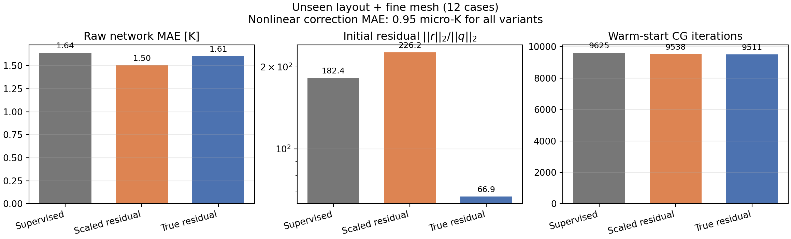

# ATPlace MGN+TRANS：离散算子约束与非线性热求解热启动报告

## 结论

“网络初值 + 非线性离散求解修正”和“真实离散算子残差”两条路径已经接通。在 12 个未见布局、fine 网格的联合 OOD 工况上：

- 纯监督 MGN+TRANS 的原始 MAE 为 1.642 K；加入真实残差后的网络为 1.606 K；
- 真实残差训练把初始相对方程残差从 182.4 降到 66.9，下降 63.3%；
- 网络输出经过温度一致的非线性 FVM 修正后，体积加权 MAE 为 `9.46e-7 K`，峰值误差为 `2.17e-6 K`；
- 修正后相对方程残差为 `8.52e-11`，相对能量不平衡为 `9.64e-12`；
- 热启动把累计 CG 迭代从 10,179 降到 9,511，修正阶段相对冷启动约快 1.055 倍；但计入网络推理后仍只有 0.964 倍，即端到端约慢 3.7%。

因此，当前方案已经解决“精度接近离散参考解”的问题，但尚未解决“端到端比直接求解更快”的问题。它适合被视为可靠的混合求解原型，而不是已经完成的高速代理模型。

> 重要口径：本报告所用 ATPlace 标签是三维正交网格、单元中心有限体积法（FVM），不是四面体 FEM。当前实现与 FVM 的离散方程一致。四面体刚度矩阵、FEM Robin 面积分和材料界面弱形式属于下一阶段，不能用本结果冒充。



## 完成内容

### 1. 网络热启动 + 非线性物理解算

MGN+TRANS 先预测温升场 `theta_0`，随后使用该场作为非线性温变导热方程的初值：

1. 由当前温度重新计算各方向导热率；
2. 重新装配内部面、接触面和顶部 Robin 面的导热系数；
3. 使用带 Jacobi 预条件的共轭梯度法求解线性子问题；
4. 用松弛 Picard 外迭代更新温度，直到最大温度更新小于 `1e-7 K`；
5. 最后再解一次与收敛温度一致的离散系统。

冷启动使用全零温升，其余容差、预条件器和算子完全相同，避免不公平对比。

### 2. 与求解器一致的真实离散算子残差

图数据不再只保存最终的边导通系数，而是保存可重装配离散算子的几何与材料契约：

- 每条有向边的法向轴 `edge_axis`；
- 源/目标单元中心到公共面的半距离；
- 公共面面积；
- 单位面积接触热阻；
- 每个单元的参考对角导热率 `(kx, ky, kz)`；
- 温度系数、参考温度和导热率缩放上下限；
- 顶部边界面面积、中心到边界半距离、对流换热系数；
- 单元热源功率。

温变导热率为

```text
k_i,a(T_i) = k_ref,i,a * clip(1 + alpha_i * (T_i - T_ref))
```

内部面（含接触热阻）的导通系数为

```text
g_ij(T) = A_ij /
          [d_i/k_i,a(T_i) + R_contact,ij + d_j/k_j,a(T_j)]
```

顶部 Robin 面的等效导通系数为

```text
g_R,i(T) = A_i / [d_i/k_i,y(T_i) + 1/h]
```

每个控制体的非线性残差为

```text
r_i(T) = sum_j g_ij(T) * (theta_i - theta_j)
         + g_R,i(T) * theta_i - Q_i
```

训练损失同时保留温度场、峰值与接触温跳监督，并加入两种互补的方程约束：

- 对角尺度残差：`(r_i / A_ii)^2`，量纲等价于局部温度误差，利于稳定训练；
- 真相对残差：`log(1 + ||r||_2^2 / ||Q||_2^2)`，直接优化求解器需要的初值质量。

图契约只使用几何、边界和参考材料参数；训练输入不读取目标解对应的最终导通系数，因此没有标签泄漏。

## Benchsize 与数据协议

| 数据集 | 工况数 | 网格 | 每图节点数 | 每图有向边数 | 每图接触面实体数 |
| --- | ---: | --- | ---: | ---: | ---: |
| train | 72 | medium | 4,560–6,072 | 25,664–34,340 | 760–1,012 |
| val | 12 | medium | 5,544–6,072 | 31,308–34,340 | 924–1,012 |
| layout-only test | 12 | medium | 5,040–6,072 | 28,416–34,340 | 840–1,012 |
| mesh-only test | 12 | fine | 7,452–9,522 | 42,408–54,418 | 828–1,058 |
| layout+mesh test | 12 | fine | 7,920–11,232 | 45,128–64,344 | 880–1,248 |

训练集包含 18 个布局，验证和测试各含 3 个互斥布局；每个布局有 4 个独立功率工况。主表使用最严格的 `layout+mesh fine`：布局与网格分布均未出现在训练中。

模型参数量为 142,819；第二版训练 100 epoch，单种子 4108，耗时 132.9 s。该结果是功能和能力验证，不是多种子统计结论。

## 联合 OOD 结果

| 模型/训练目标 | 原始 MAE (K) | 原始峰值误差 (K) | 初始相对残差 | 热启动累计 CG | 修正阶段加速 | 端到端加速 |
| --- | ---: | ---: | ---: | ---: | ---: | ---: |
| 原纯监督 checkpoint | 1.642 | 1.568 | 182.4 | 9,625 | 1.033x | 0.942x |
| 对角尺度残差 v1 | **1.503** | **1.144** | 226.2 | 9,538 | 1.037x | 0.943x |
| 对角尺度 + 真相对残差 v2 | 1.606 | 1.266 | **66.9** | **9,511** | **1.055x** | **0.964x** |
| 冷启动离散求解 | — | — | — | 10,179 | 1.000x | 1.000x |

不同运行中的墙钟时间受 CPU 抖动影响，迭代数比毫秒数更稳定。v2 明显降低了初始相对残差，但累计 CG 只下降约 6.6%，说明当前瓶颈还包括 Picard 外迭代、条件数和 Jacobi 预条件器，而不仅是初值。

三种网络版本经过同一个非线性修正后，都会收敛到约 `0.95 micro-K` 的标签 MAE。这证明精度来自“网络 + 一致离散修正”的完整组合，不应把微开尔文误差归因于裸网络。

## 为什么旧的简化校正不能使用

旧实现用参考导热率和固定算子做少量 Jacobi 更新，不能同步重装配温变导热率、接触热阻与 Robin 边界。在种子 4108 上，未见布局 medium 工况的 MAE 从 1.375 K 经 1 步更新恶化到 1.827 K，3 步和 5 步进一步恶化到 2.721 K、3.575 K。该路径已经在新配置中禁用。

本次修正与之不同：每轮都重装配与当前温度一致的完整算子，并以严格残差和更新容差收敛。

## 工程判断与下一步

若目标是“结果尽量接近参考求解器”，当前推荐输出是 `MGN+TRANS -> 非线性 FVM 修正`。若目标是“比参考求解器明显更快”，当前实现仍不达标，应按下面顺序优化：

1. 用 AMG、IC/ILU 或多层图预条件替代 Jacobi；当前约 9,500 次累计 CG 是最明显瓶颈。
2. 将网络训练目标改为预测非线性误差/校正量或粗网格解，而非只预测绝对温度；使初值直接服务于 Newton/Krylov 收敛。
3. 把 Picard 换成阻尼 Newton、Anderson acceleration 或 JFNK，并记录残差下降曲线，而不只记录总迭代。
4. 扩大独立材料卡、接触热阻、边界换热和几何族，并按整个物理族分组留出，避免只学到固定 Case1 分布。
5. 转入真正的四面体 FEM 主线时，用单元刚度、内部材料界面面、Robin 边界面和载荷向量建立弱形式残差；重新生成标签后再报告“接近 FEM”。

这一思路与“神经网络作为数值求解器 warm start”、变分积分神经算子和图 Galerkin 方法的方向一致，可对照 [JCP warm-start solver](https://www.sciencedirect.com/science/article/pii/S0021999125001548)、[VINO](https://doi.org/10.1016/j.cma.2025.117785) 和 [Graph Neural Galerkin](https://arxiv.org/abs/2107.12146)。跨分辨率图算子设计可继续参考 [MultiScale MeshGraphNets](https://arxiv.org/abs/2210.00612)、[RIGNO](https://arxiv.org/abs/2501.19205) 与 [Transolver++](https://arxiv.org/abs/2502.02414)。

## 复现

```powershell
# 为现有高级材料数据补齐可重装配的离散算子契约
E:\Anaconda\python.exe src\upgrade_atplace_operator_contract.py

# 训练真实残差对齐的 MGN+TRANS
E:\Anaconda\python.exe src\train_atplace_ml.py `
  --data data\atplace_case1_contact_material_ml_operator `
  --config configs\atplace_case1_contact_material_operator_aligned.yaml `
  --out outputs\atplace_case1_contact_material_operator_aligned_v2 `
  --models mgn_transolver --seeds 4108

# 未见布局 + fine 网格：热启动与冷启动对照
E:\Anaconda\python.exe src\evaluate_atplace_warm_start.py `
  --checkpoint outputs\atplace_case1_contact_material_operator_aligned_v2\seed_4108\mgn_transolver\checkpoint.pt `
  --data data\atplace_case1_contact_material_ml_operator\eval_layout_mesh_fine.pt `
  --out outputs\atplace_case1_contact_material_operator_aligned_v2\warm_start_layout_mesh_fine.json

# 生成对比图
E:\Anaconda\python.exe src\plot_atplace_operator_alignment.py
```

机器可读结果位于：

- `outputs/atplace_case1_contact_material_operator_aligned_v2/seed_4108/mgn_transolver/metrics.json`
- `outputs/atplace_case1_contact_material_operator_aligned_v2/warm_start_layout_mesh_fine.json`

核心实现位于：

- `src/atplace_nonlinear_operator.py`
- `src/upgrade_atplace_operator_contract.py`
- `src/evaluate_atplace_warm_start.py`
- `src/train_atplace_ml.py`

