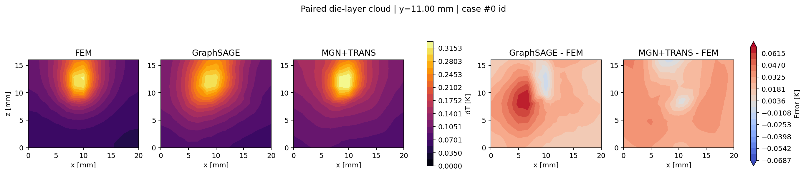
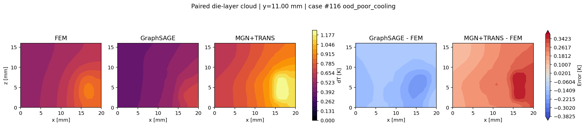

# 三维 FEM 离散算子学习：实现与扩展工况单种子测评

本报告记录 2026-09-16 完成的第二阶段实现。目标不是让网络只拟合温度图片，而是让输入、损失和前向更新直接使用与标签求解器一致的 P1 四面体离散算子。此前的三种子架构结论见[修正 benchmark](mgn_transolver_3d_corrected_benchmark_report.md)；本报告的新扩展数据结果目前只有训练种子 3107，属于进入三种子复验前的能力检查。

## 已实现的离散物理

对温升 `θ=T-T_ambient`，FEM 自由节点系统为

```text
(K_cond + R_top) θ = f_source
```

- `K_cond`：逐四面体 `kₑVₑ∇φᵢ·∇φⱼ` 装配，包含真实单元尺寸、形状和材料导热率。
- `R_top`：顶部三角面的完整 Robin 质量矩阵 `hA/12 [[2,1,1],[1,2,1],[1,1,2]]`，不再只给节点一个 `h_top` 标量。
- `f_source`：与 FEM 求解完全相同的 `∫qφᵢdV`；图热源继续使用 `qᵢ=fᵢ/mᵢ` 保证总功率一致。
- 材料界面：保存界面两侧四面体节点、P1 梯度、法向、面积和两侧 `k`，可以比较 FEM 与预测的法向热流。

图新增 4 个节点特征：`f/Aii`、导热对角占比、Robin 对角占比、自由节点标记；新增 3 个有向边特征：`Kij/Aii`、`Rij/Aii`、跨材料标记。每张图还携带完整稀疏 `K+R`，用于物理损失和前向校正。FEM 标签代回局部加密图算子，自由节点行归一化残差 RMS 为 **`4.24×10⁻⁸ K`**。

训练目标为温度场、峰值、die 梯度、能量残差和材料界面热流的加权和。MGN+TRANS 在网络初值后执行 3 次阻尼 Jacobi：

```text
θ ← θ - 0.65 diag(A)⁻¹(Aθ-f),  A=K+R
```

底部 Dirichlet 节点每步强制为零温升。三次更新只是线性复杂度的局部校正；若迭代至完全收敛就重新变成数值求解器，不再是快速代理。

## 扩展 benchsize 与网格分布

每种网格使用完全相同的 **576 个独立物理工况：384 train / 64 val / 128 test**。训练集包含 ID 192、高功率覆盖 64、低 TIM 覆盖 64、弱冷却覆盖 64；测试集含 ID 44、三类覆盖工况各 16、三类更严格且区间不重叠的 OOD 各 12。四张训练网格因此产生 `384×4=1,536` 张训练图，但独立物理工况仍只计 384。

| 网格 | 角色 | 节点 | 四面体 | 有向边 | 材料界面三角面 |
| --- | --- | ---: | ---: | ---: | ---: |
| 粗 `(9,13,7)` | 训练 | 819 | 3,456 | 9,412 | 288 |
| 中 `(13,13,11)` | 训练/验证 | 1,859 | 8,640 | 22,532 | 720 |
| 各向异性 `(15,13,9)` | 训练 | 1,755 | 8,064 | 21,140 | 672 |
| 中央局部加密 2 轮 | 训练 | 2,237 | 10,368 | 26,792 | 816 |
| 细 `(17,13,15)` | 留出 | 3,315 | 16,128 | 41,220 | 1,344 |
| 偏移局部加密 3 轮 | **留出** | 2,846 | 13,986 | 35,378 | 1,074 |

偏移局部网格的加密中心为 `(x,z)=(0.68,0.32)`，宽度比例 `(0.38,0.50)`，不同于训练中的中央加密区域。数据范围和严格 OOD 区间见[扩展数据配置](../configs/data_config_3d_operator_learning.yaml)，网格角色见[网格族配置](../configs/mesh_family_3d_operator.yaml)。

## 40 轮单种子结果

GraphSAGE 与 MGN+TRANS 使用相同 30 维节点输入、物理损失、工况和 split。GraphSAGE 不消费边特征，也没有 Jacobi 前向校正；混合模型使用 8 状态、1 个全局块。训练 batch size 为 **4 图**，二者均在第 38 轮得到最佳中网格验证 checkpoint。

| 模型 | 参数 | 训练时间 | CUDA 峰值显存 |
| --- | ---: | ---: | ---: |
| GraphSAGE | 20,481 | 371.6 s | 71.8 MiB |
| MGN+TRANS+FEM | 142,755 | 683.8 s | 617.2 MiB |

| 测试网格 | 模型 | MAE K ↓ | die 梯度 K/mm ↓ | 峰值误差 K ↓ | 能量残差相对值 ↓ | 界面热流相对 L2 ↓ | 工况 MAE P95 K ↓ |
| --- | --- | ---: | ---: | ---: | ---: | ---: | ---: |
| 中 | GraphSAGE | 0.1636 | 0.0296 | 0.4684 | 1.0112 | 1.1346 | 0.6940 |
| 中 | MGN+TRANS+FEM | **0.0920** | **0.0212** | **0.3259** | **0.4745** | **0.4198** | **0.3690** |
| 细/留出 | GraphSAGE | 0.1596 | 0.0312 | 0.4552 | 1.0410 | 1.1242 | 0.6721 |
| 细/留出 | MGN+TRANS+FEM | **0.0905** | **0.0269** | **0.3455** | **0.8209** | **0.7761** | **0.3591** |
| 偏移局部/留出 | GraphSAGE | 0.2456 | 0.0355 | 0.4929 | 3.6022 | 1.7048 | 0.9050 |
| 偏移局部/留出 | MGN+TRANS+FEM | **0.1375** | **0.0284** | **0.3673** | **1.3601** | **0.6579** | **0.5751** |

偏移局部网格中混合模型相对 GraphSAGE 的逐 case MAE 平均差为 **`-0.1081 K`**，128 case bootstrap 95% 区间 `[-0.1512,-0.0717]`，逐 case 胜率 80.5%；die 梯度差 `-0.00704 K/mm [-0.00910,-0.00513]`。能量和界面热流差也均为负。但这些区间只重采样测试 case，**没有包含训练初始化不确定性**，不能替代至少三种子重训。

严格 OOD 中，低 TIM 在偏移局部网格的 MAE 已降至 `0.1770 K`；极弱冷却仍为 `0.5316 K`，是当前最大短板。扩大覆盖修复了此前低 TIM 崩溃，但没有消除对流边界整体温升的极端外推问题。





第二张图显示 GraphSAGE 整体低估、混合模型整体高估；混合模型在总体 128 case 上更好，不代表每个极弱冷却样本都已准确。

## 结论与下一道门槛

当前单种子结果说明，把 FEM 离散算子用于**输入 + 损失 + 前向迭代**，再增加独立工况和训练网格，比单纯加深 attention 更有效；这次在留出细网格和偏移局部网格上，温度、梯度、峰值、能量和界面通量全部同时改善。代价是混合模型约 7 倍参数、9 倍单图模型前向时间量级，并且仍不等于任意 CAD 泛化。

下一步必须执行种子 `3108/3109` 重训与配对 seed×case 区间；若仍稳定，再增加不同层厚、接触热阻、多热点与独立非张量网格生成器。极弱冷却应增加边界换热覆盖或使用全局能量平衡校正，不能仅靠继续增大残差权重。

复现入口：

```powershell
python src/generate_operator_dataset_family_3d.py

python src/train.py --model mgn_transolver --seed 3107 --epochs 40 `
  --config configs/train_config_3d_operator_learning.yaml `
  --data_dir data/processed_3d_operator_medium `
  --extra_train_dirs data/processed_3d_operator_coarse `
    data/processed_3d_operator_anisotropic data/processed_3d_operator_local_center `
  --out_dir outputs/3d/operator_expanded_seed3107

python src/evaluate.py --data_dir data/processed_3d_operator_local_offset `
  --ckpt_dir outputs/3d/operator_expanded_seed3107/checkpoints `
  --out_dir outputs/3d/operator_expanded_seed3107/eval_local_offset `
  --models baseline mgn_transolver --cross_mesh
```
