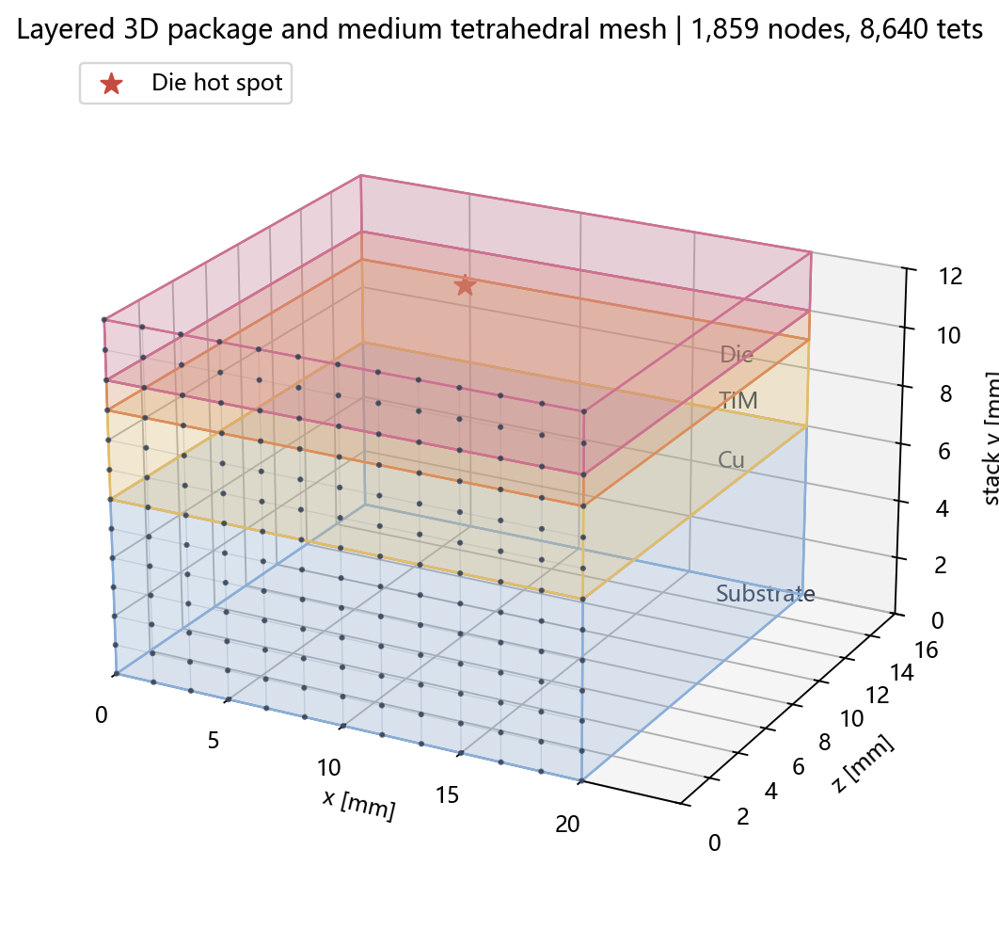
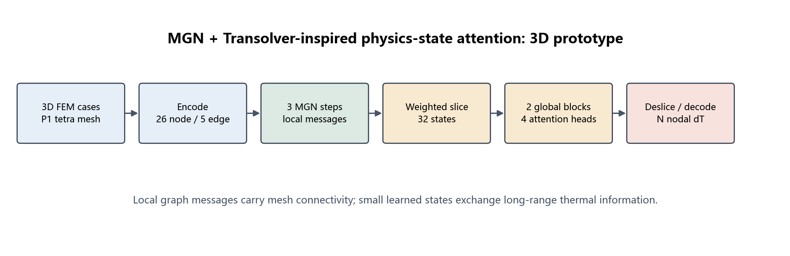
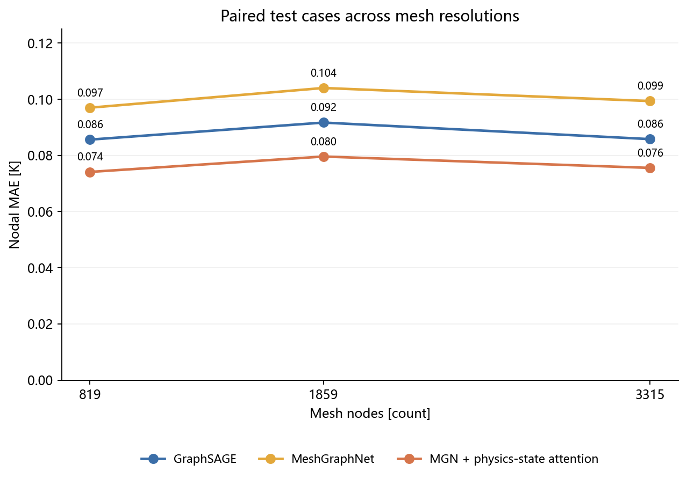
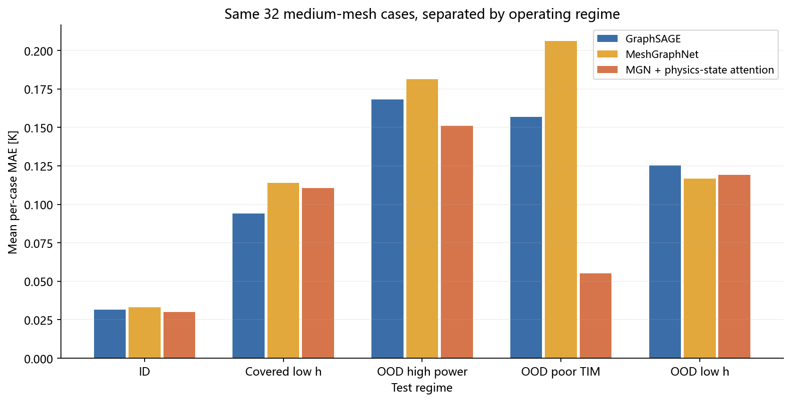
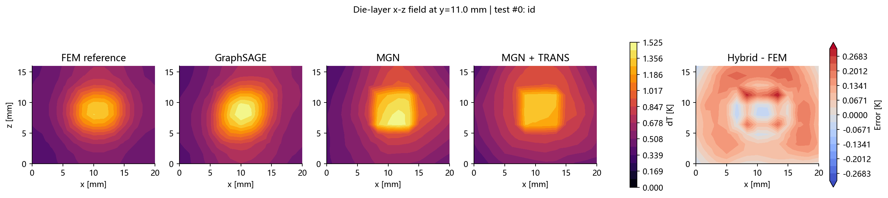
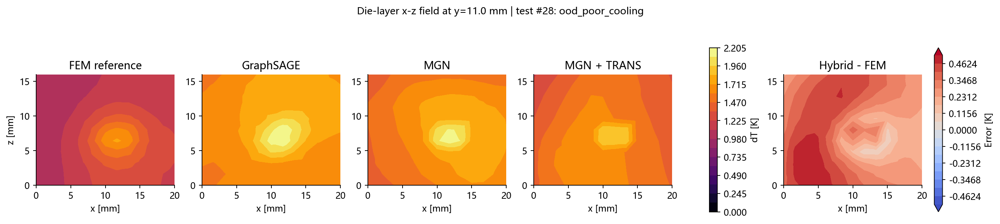

# 三维 MGN+TRANS：跨网格误差最低，但速度与证据强度仍限制应用

本报告记录 2026-09-15 在当前仓库实际运行的三维 FEM、三模型训练及配对网格能力测评；报告对应单次训练种子 2024，不引用旧的 2D/3D GraphSAGE 实验结果作为本次对照。模型与网格的原理详见 [三维原型说明](mgn_transolver_3d_technical_documentation.md)。

## 摘要

- 中网格 32 个测试工况中，MGN+TRANS 的总体节点 MAE **0.0796 K**，GraphSAGE **0.0917 K**，纯 MGN **0.1040 K**；混合模型对低 TIM 导热的严格 OOD 工况有明显的本次样本收益，但正常 ID 与极弱冷却工况差别不大。
- 仅在 1,859 节点网格训练后，混合模型在 819 和 3,315 节点网格的配对测试 MAE 为 **0.0741/0.0755 K**。这是固定封装、规则张量网格改变分辨率的初步迁移证据，**不能代表任意非结构网格或新几何的泛化**。
- 与 GraphSAGE 的 32 工况配对 bootstrap，三网格的 95% 区间均跨零；混合模型虽有最低平均 MAE，尚不能稳健宣称优于小基线。混合模型参数约为 GraphSAGE 的 36.7 倍，中网格前向 **7.47 ms/样本**，GraphSAGE **0.58 ms/样本**。建议把它作为继续验证的研究主线，不把本次结果当成生产性能结论。

## Benchmark 范围、benchsize 与网格信息

三套数据的物理工况、采样种子和样本顺序逐条一致。**每网格 benchmark size 为 144 个 FEM 样本（训练 96、验证 16、测试 32）**；仅中网格的 96/16 样本用于训练/选 checkpoint，粗/细网格只评估各自的 32 个同工况测试样本。每模型 80 epoch 上限，训练 **batch size = 2 图**；推理吞吐 **benchmark batch size = 4 图**，预热后 5 次重复，单样本耗时同样是预热后 5 次前向的均值。无跨模型并行计时。

| 网格 | 采样节点 `(nx,ny,nz)` | FEM 节点 | P1 四面体 | 去重有向边 | 测试样本 | 测试 FEM 平均求解耗时 |
| --- | --- | ---: | ---: | ---: | ---: | ---: |
| 粗 | `(9,13,7)` | 819 | 3,456 | 9,412 | 32 | 10.83 ms |
| 中/训练 | `(13,13,11)` | 1,859 | 8,640 | 22,532 | 32 | 28.09 ms |
| 细 | `(17,13,15)` | 3,315 | 16,128 | 41,220 | 32 | 134.71 ms |

测试配比为正常 ID 12、已覆盖弱冷却 8、严格 OOD 高功率 4、低 TIM 导热 4、极弱冷却 4。`h_top` 的正常/已覆盖/严格 OOD 区间分别为 `500–15000`、`100–400`、`20–80 W/(m²·K)`；后者与训练区间没有重叠。其他参数区间在 [benchmark 数据配置](../configs/data_config_3d_mgn_transolver_benchmark.yaml) 中冻结。

## 模型、训练与 FEM 校验

对照模型为 3 层宽度 64 的 GraphSAGE、2 轮宽度 64 的纯 MeshGraphNet，以及宽度 128、3 轮 MGN 消息传递、2 个全局 block/4 头/32 切片的混合模型。三者统一使用温升 `ΔT` 监督、相同的按样本相对场损失和 `0.1 ×` 全图最大温升损失、Adam 初始学习率 `1e-3`、中网格验证集选择 checkpoint。它们并不等参数量；若要隔离 attention 本身的增益，需要另做等容量消融。

| 模型 | 参数量 | 最优 epoch / 共训练 | 训练耗时 | 训练 CUDA 峰值显存 |
| --- | ---: | ---: | ---: | ---: |
| GraphSAGE | 19,969 | 80 / 80 | 37.5 s | 37.8 MiB |
| 纯 MGN | 73,281 | 67 / 80 | 48.5 s | 207.9 MiB |
| MGN+TRANS | 732,803 | 64 / 80 | 184.0 s | 725.9 MiB |

仓库完整单元测试 **40 项通过**（包含变化节点数的混合模型图 batch 测试、跨网格 contract 测试以及新 FEM 插值辅助测试）。另用真实粗/细测试图组成一个 `819+3315=4134` 节点的混合 batch 前向，分别与两个单图前向核对，最大标准化输出差为 `3.58e-7 / 5.96e-7`，验证图 ID 隔离在实际不同节点规模数据上成立。三维 FEM 的制造解 convergence check 在 `n=9/13/17` 的立方 P1 四面体网格上，节点 RMSE 为 `7.6178e-3 / 3.6276e-3 / 2.1100e-3`，观测收敛阶 **1.830 / 1.884**。这验证求解器有预期收敛趋势，不构成全部封装工况的实验校准。

## 精度、热点与跨网格能力

下表的 MAE 是所有测试样本节点的总体平均绝对温升误差；`体积 MAE` 以 P1 lumped 节点体积为权重。相对 L2 对所有测试节点的 `ΔT` 合并计算；热点误差是逐工况预测最大 `ΔT` 与 FEM 最大 `ΔT` 的绝对差的均值。没有以环境温度稀释相对误差。

| 网格 | 模型 | 节点 MAE (K) | 体积 MAE (K) | 相对 L2 | 平均热点绝对误差 (K) | 单样本推理 | batch=4 摊销推理 |
| --- | --- | ---: | ---: | ---: | ---: | ---: | ---: |
| 粗 | GraphSAGE | 0.0856 | 0.0842 | 0.3254 | 0.2212 | 0.59 ms | 0.13 ms/样本 |
| 粗 | 纯 MGN | 0.0970 | 0.0943 | 0.4848 | 0.2403 | 1.10 ms | 0.87 ms/样本 |
| 粗 | MGN+TRANS | **0.0741** | **0.0745** | **0.2864** | **0.1900** | 3.83 ms | 2.94 ms/样本 |
| 中 | GraphSAGE | 0.0917 | 0.0904 | 0.3512 | 0.2957 | 0.58 ms | 0.28 ms/样本 |
| 中 | 纯 MGN | 0.1040 | 0.1010 | 0.5123 | 0.3147 | 2.28 ms | 2.00 ms/样本 |
| 中 | MGN+TRANS | **0.0796** | **0.0796** | **0.2999** | **0.2092** | 7.47 ms | 6.12 ms/样本 |
| 细 | GraphSAGE | 0.0858 | 0.0842 | 0.3322 | 0.3348 | 0.70 ms | 0.48 ms/样本 |
| 细 | 纯 MGN | 0.0993 | 0.0959 | 0.4972 | 0.3101 | 3.82 ms | 3.56 ms/样本 |
| 细 | MGN+TRANS | **0.0755** | **0.0752** | **0.2924** | **0.1934** | 12.05 ms | 10.65 ms/样本 |

中网格相对 GraphSAGE 的平均 MAE 降幅为约 **13.2%**，相对纯 MGN 约 **23.5%**；同时单样本模型前向比 GraphSAGE 慢约 **12.9 倍**。按本次测试 FEM 耗时，中网格混合模型单样本前向约 **3.76×** 加速，batch=4 约 **4.59×**；细网格分别约 **11.18× / 12.65×**。这些加速比只能比较此环境的已处理图模型前向与本仓库 FEM 求解时间，不包括网格生成、特征预处理、设备传输或生产 FEM 设置。

### 工况分解：收益集中在低 TIM 导热

| 中网格测试工况 | n | GraphSAGE MAE | 纯 MGN MAE | MGN+TRANS MAE | 混合模型平均热点误差 |
| --- | ---: | ---: | ---: | ---: | ---: |
| 正常 ID | 12 | 0.0316 | 0.0332 | 0.0300 | 0.1257 K |
| 已覆盖弱冷却 | 8 | **0.0942** | 0.1141 | 0.1107 | 0.1811 K |
| 严格 OOD 高功率 | 4 | 0.1680 | 0.1813 | **0.1509** | 0.2623 K |
| 严格 OOD 低 TIM 导热 | 4 | 0.1570 | 0.2062 | **0.0553** | 0.2987 K |
| 严格 OOD 极弱冷却 | 4 | 0.1252 | **0.1168** | 0.1193 | 0.3732 K |

混合模型在极弱冷却的场 MAE 与小基线接近，但该组热点误差 **0.3732 K**，高于 GraphSAGE 的 **0.2233 K**；这是热点安全用途需要继续测试的短板。每个严格 OOD 类仅 4 个工况，不应把这里的排序解释成该工况总体分布的稳定排序。

### 配对不确定性和 FEM 标签变化

对每个网格的同一 32 个物理测试工况，以 `混合模型 MAE - 对照 MAE` 为逐工况差值，固定种子做 10,000 次**工况重采样**。负值表示混合模型更好。下列 95% percentile 区间只反映测试工况抽样；不包含重训种子、网格形状或 FEM 真实模型误差。

| 网格 | 相对 GraphSAGE：均值差 (K)、95% 区间 | 相对纯 MGN：均值差 (K)、95% 区间 | 比 GraphSAGE 逐工况更好的比例 |
| --- | --- | --- | ---: |
| 粗 | `-0.0115 [-0.0286, 0.0039]` | `-0.0229 [-0.0484, -0.0034]` | 46.9% |
| 中 | `-0.0121 [-0.0321, 0.0056]` | `-0.0244 [-0.0518, -0.0032]` | 46.9% |
| 细 | `-0.0102 [-0.0289, 0.0069]` | `-0.0238 [-0.0504, -0.0036]` | 40.6% |

所以“平均误差最低”并不意味着它赢得大多数单个样本；相对 GraphSAGE 的优势主要来自若干难例，区间也跨零。相对纯 MGN 的本批样本差异更明确，但等容量 architecture 归因尚未进行。

三网格的 FEM 参考解并非完全相同：将中网格 FEM 节点场三线性插值到粗/细网格节点后，32 个同工况测试样本的 FEM-FEM 平均 MAE 分别为 **0.0205/0.0174 K**，平均峰值差 **0.0807/0.0714 K**。它们是跨分辨率的**参考标签漂移诊断**，不是连续真实解误差上界。报告中的跨网格 surrogate MAE 各自对该网格 FEM 求值，因此不能单凭 MAE 改善断言连续物理泛化；还需做网格收敛参考解和非结构拓扑测试。

## 能力判断与边界

当前证据支持：在固定几何、相同材料层平面、张量四面体分辨率变化且输入 feature contract 不变时，MGN+TRANS checkpoint 能直接处理无 padding 的新节点数，体积加权和非加权平均误差都低于本次纯 MGN；在低 TIM 导热 OOD 小样本上有潜在长距离耦合收益。当前证据**不支持**：任意非结构重剖分、新芯片层/新几何、动态瞬态热场、多芯片多热点、实测校准、极弱冷却热点安全精度，或全流程端到端加速。

下一轮最有价值的验证是同工况的非结构/局部加密四面体网格、至少 3 个训练种子、等参数量纯 MGN/状态 attention 消融，以及比当前 3,315 节点更大网格的显存/速度曲线。若以工程推理速度为先，GraphSAGE 当前仍更划算；若以跨网格研究及低 TIM OOD 为主线，保留 MGN+TRANS 路径继续扩展是合理的。

## 可审查证据与运行环境

原始数据和处理后的图位于 `data/raw_3d_mgn_transolver_benchmark_{coarse,medium,fine}` 与 `data/processed_3d_mgn_transolver_benchmark_{coarse,medium,fine}`，因规模可再生而由 `.gitignore` 排除；模型 checkpoint 也仅保留本地，不随报告版本化。配置、生成/训练/评估/绘图命令在 [三维原型说明](mgn_transolver_3d_technical_documentation.md) 固定。训练摘要与每模型、每网格的逐工况 CSV / 总结 JSON 位于 [benchmark 结果目录](../outputs/3d/mgn_transolver_benchmark/)；[配对 bootstrap](../outputs/3d/mgn_transolver_benchmark/metrics/paired_case_bootstrap.json)、[FEM 标签漂移](../outputs/3d/mgn_transolver_benchmark/metrics/mesh_reference_shift.json)、[制造解收敛](../outputs/3d/mgn_transolver_benchmark/metrics/mms_3d_convergence.json) 可直接核算本文数值。

计时环境为 Windows + NVIDIA RTX 3060 CUDA、PyTorch `2.5.1+cu121`、PyG `2.8.0.post1`、scikit-fem `12.0.2`、SciPy `1.13.1`、NumPy `1.26.4`。CUDA 单样本计时先预热、每次计时前后同步；批量吞吐计时预热后对完整 32 样本测试集重复 5 次。FEM 数据按样本记录 scikit-fem solve/assemble 时间，硬件、运行负载和冷启动差异会影响绝对耗时。
