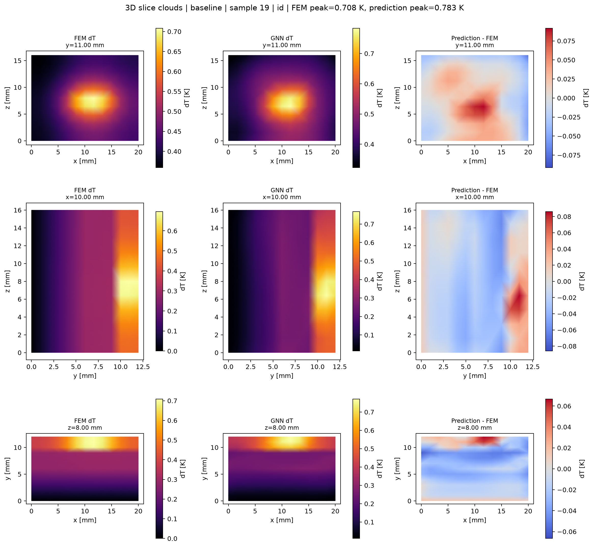
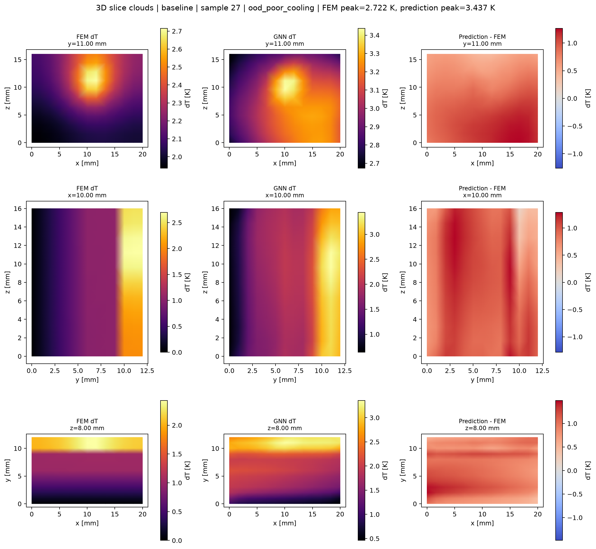
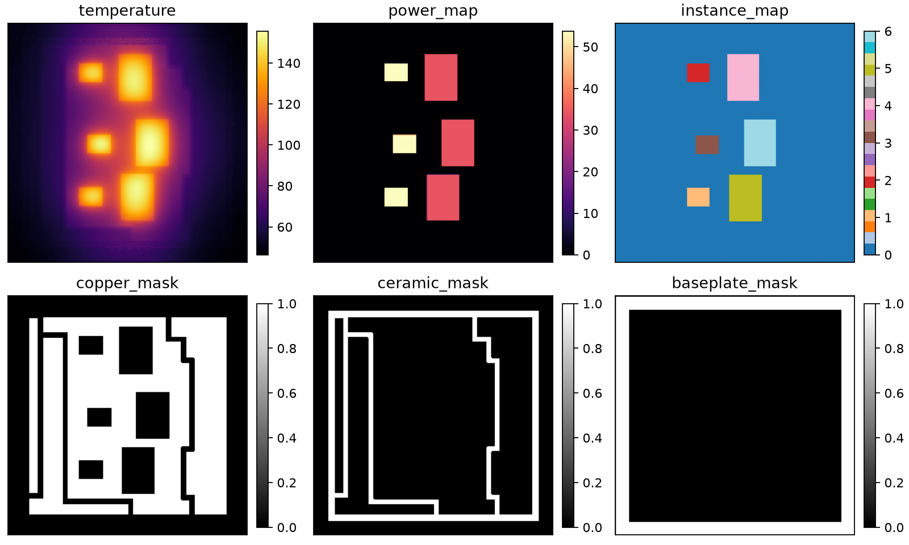

# 三维可复现基线：执行记录与参考算例审查

本文件是 `three_dimensional_report.md` 的已执行结果补充。除特别标为“外部参考”的内容外，数值、图像和测试均来自本仓库在 `.venv-3d` 中的实际运行。二维流程没有修改；三维流程使用独立的原始/处理数据目录和输出目录。二维与三维的统一技术说明和全部开源引用见 `technical_documentation.md`。

## 1. 管线与物理模型

```text
分层封装几何 + die 内 x-z 矩形热点
  -> P1 四面体网格（scikit-fem）
  -> 稳态 FEM 节点温升与四面体连通性
  -> 由四面体六条边去重、双向化的 PyG 图
  -> GraphSAGE 基线 / 紧凑 MeshGraphNet 探针
  -> MAE、峰值误差、OOD、时间、RSS 与切面云图
```

三维域为 \(\Omega=[0,W]\times[0,H]\times[0,D]\)，其中 \(y\) 是封装堆叠方向。稳态导热方程、边界条件和 P1 四面体离散分别为

\[
-\nabla\!\cdot(k\nabla T)=q,\qquad
T=T_{amb}\;(\Gamma_{bottom}),\qquad
-k\nabla T\!\cdot n=h_{top}(T-T_{amb})\;(\Gamma_{top}).
\]

\[
K_{ij}^{(e)}=\int_{V_e}k\nabla N_i\!\cdot\nabla N_j\,dV,
\qquad f_i^{(e)}=\int_{V_e}qN_i\,dV.
\]

顶面对流以 Robin 项 \(h_{top}\int_{\Gamma_{top}}Tv\,d\Gamma\) 装配；侧面绝热。热点仅作用于 die 内的 \(x-z\) 矩形，并沿 die 厚度延展。每个四面体贡献六条无向边，去重后以两个方向写入 `edge_index`。完整图包含 1,859 个节点、8,640 个四面体和 22,532 条有向边；节点特征为 24 维，边特征为 5 维。

## 2. 环境、数据与冒烟验证

隔离环境为 Python 3.12、scikit-fem 12.0.2、PyTorch 2.13.0+cpu、PyG 2.8.0.post1、SciPy 1.18.1、NumPy 2.5.2。依赖通过 `pip --use-feature=truststore` 安装，使用系统受信任证书存储；没有关闭 TLS 证书校验。该主机没有 CUDA，内存报告为 CPU 进程 RSS，CUDA 显存记为 N/A。

小规模数据集（24/4/6）已实际生成和图化：每图 1,859 节点、8,640 四面体、22,532 有向边，峰值温升为 0.2987--2.1923 K，单图张量约 0.972 MiB。完整固定种子训练集为 300/30/30；原始 FEM 生成耗时 39.41 s，平均单样本 FEM 求解为 92.61 ms。

实际执行：

```powershell
.\.venv-3d\Scripts\python.exe -m pytest tests/test_fem_solver_3d.py tests/test_graph_dataset_3d.py tests/test_mms_3d.py -q
```

结果为 **6 passed**（仅有两条 PyTorch `torch.jit.script` 弃用警告）。测试覆盖四面体网格/边界、正热源温升、x-z 热点位置、图边双向性与节点/边特征，并新增制造解（MMS）收敛检查。

### 制造解收敛验证

为将代码正确性与芯片物理案例分开验证，在单位立方体使用

\[
T^*(x,y,z)=\sin(\pi x)\sin(\pi y)\sin(\pi z),\qquad
q=3\pi^2T^*,
\]

并在所有边界施加与解析解一致的零 Dirichlet 条件。实际结论如下：

| 每轴节点数 | 节点数 | 四面体数 | 节点 RMSE | 最大绝对误差 |
| ---: | ---: | ---: | ---: | ---: |
| 5 | 125 | 384 | 2.4351e-2 | 9.5072e-2 |
| 9 | 729 | 3,072 | 7.6178e-3 | 2.5201e-2 |
| 13 | 2,197 | 10,368 | 3.6276e-3 | 1.1324e-2 |

相邻网格的观测收敛阶分别为 **1.677** 与 **1.830**，误差单调下降，符合线性四面体对光滑解析解的预期收敛趋势。原始机器可读记录见 `outputs/3d/metrics/mms_3d_convergence.json`。

## 3. 可信主基线与紧凑 MGN 探针

GraphSAGE 使用 3 层、隐藏维度 64、batch size 4、4 CPU 线程和固定种子 2024。最佳验证损失出现在第 69 epoch，早停后共训练 94 epoch；参数量为 19,713。MeshGraphNet 仅作为低成本试验，使用 2 次消息传递、64 隐藏维度、batch size 8、12 epoch；不是充分调优后的替代模型。

| 指标 | 3D GraphSAGE | 紧凑 3D MeshGraphNet |
| --- | ---: | ---: |
| 参数量 | 19,713 | 73,153 |
| 总体 MAE | **0.0835 K** | 0.1433 K |
| 峰值温升绝对误差 | **0.1206 K** | 0.1529 K |
| 加权 OOD MAE | **0.1866 K** | 0.3060 K |
| 单样本推理 | **7.43 ms** | 19.13 ms |
| 训练 RSS 峰值 | 597.64 MiB | 887.57 MiB |
| 评估 RSS | 600.84 MiB | 未单独报告 |

GraphSAGE 的 OOD 分解为：ID 0.0319 K、高功率 0.0489 K、低 TIM 导热 0.0283 K、差散热 0.5283 K。因而可信结论是：当前三维主基线已建立，但顶面对流劣化是最显著的外推短板；在该数据量和配置下，不应以 MGN 取代 GraphSAGE。

## 4. 2D 与 3D 的已测对比

| 指标 | 2D GraphSAGE | 3D GraphSAGE |
| --- | ---: | ---: |
| 参数量 | 104,321 | 19,713 |
| 节点 / 有向边 | 2,257 / 13,152 | 1,859 / 22,532 |
| MAE | 0.1035 K | **0.0835 K** |
| 峰值误差 | 0.3431 K | **0.1206 K** |
| 加权 OOD MAE | 0.2490 K | **0.1866 K** |
| 平均 FEM | 8.50 ms | 112.25 ms |
| 单样本推理 | 54.94 ms | 7.43 ms |
| 评估 RSS | 520.09 MiB | 600.84 MiB |

三维边数比二维多约 71%，FEM 求解也明显更慢；不过两模型的宽度/层数不同（2D 为 4 层、128 维；3D 为 3 层、64 维），所以推理时间不能归因于“维度”本身。可比较的观察是：本数据与配置下，三维降低了场 MAE、峰值误差和加权 OOD MAE，但代价是更高的 FEM 数据生成成本和约 81 MiB 的额外 RSS。完整表格见 `outputs/3d/metrics/comparison_2d_vs_3d_baseline.{csv,md}`。

## 5. 三维切面云图：已生成结果

每张图按列展示 FEM 温升、GraphSAGE 预测和“预测 - FEM”误差；按行展示 die 中心的 x-z 热点面、中心 y-z 面和中心 x-y 面。

中位 ID 样本（#19）的 FEM 峰值为 0.708 K，预测峰值为 0.783 K。热点位置、厚度方向扩散与整体场型均被复现，局部误差约在 \(\pm0.09\) K 范围内。



最具挑战的差散热 OOD 样本（#27）FEM 峰值为 2.722 K，预测峰值为 3.437 K。三个切面均显示模型将温升在大范围整体高估，和该工况 0.5283 K 的 OOD MAE 一致。这是当前模型边界条件外推不足的直接证据，应保留在后续对比中。



图像由 `src/visualize_3d.py` 生成，使用位于网格坐标面的节点切片和三角剖分渲染；它并不把二维云图冒充为三维结果。生成命令为：

```powershell
.\.venv-3d\Scripts\python.exe src/verify_mms_3d.py
.\.venv-3d\Scripts\python.exe src/visualize_3d.py --model baseline
```

## 6. 开源资源：已取得与可复现性审查

| 资源 | 本次状态 | 可用于什么 | 当前限制 |
| --- | --- | --- | --- |
| [MFIT](https://github.com/AlishKanani/MFIT) | 已下载至 `external/MFIT`，审查完成 | 2.5D/3D 多芯粒 RC/DSS；三组几何/功耗输入案例；其说明指向 Fluent 参考案例 | GPL-3.0；求解器为 Linux ELF `.so`，源代码在 Windows 明确退出；SuperLU 安装说明只覆盖 Linux，故本机未运行 |
| [MOOSE heat-conduction verification](https://mooseframework.inl.gov/releases/moose/2022-06-10/getting_started/examples_and_tutorials/tutorial03_verification/index.html) | 在线参考 | MMS、网格收敛与误差范数的验证方法 | 不是芯片封装案例；本仓库已实现等价的独立 3D MMS 验证 |
| [scikit-fem](https://github.com/kinnala/scikit-fem) | 当前实际依赖 | 四面体网格与稀疏 FEM 装配 | 是实现基础，不是独立芯片基准 |
| [Multi-topology thermal dataset](https://github.com/henkuailederen/Multi-topology-Dataset) | 完整浅克隆因约 4.67 GB 的传输未在时限内完成；但已按官方路径选择性下载清单、检查脚本和 1 个 HDF5 样本，并成功运行检查 | 跨拓扑、功耗和换热系数的顶表面温度场代理 | CC BY 4.0；它是二维顶表面规则栅格而不是三维体网格，不能与本项目的 3D 节点 MAE 直接横比 |

对 Multi-topology 已实际运行其公开 `inspect_sample.py`，读取的 `Mask_HB_V3-0/141_Pigbt450_Pfwd200_h6000` 样本包含 `(256,256)` 顶表面温度、功率密度、芯片实例、铜/陶瓷/底板掩膜、6 个芯片峰值和换热系数。实测字段范围为：温度 46.3787--155.626 \(^\circ\)C，功率图 0--53.7925，\(h=6000\)（`h_normalized=0.6`），6 个芯片峰值为 145.440--155.626 \(^\circ\)C。官方样本检查图已保存为 `outputs/3d/figures/reference_multi_topology_sample.png`。



这构成一项**外部数据格式与可视化对比实验**，但不是同几何的精度竞赛：其标签是绝对摄氏温度的顶部二维场，本项目标签是三维节点温升；两者网格、封装、热源定义和边界均不同。因此没有虚构跨数据集 MAE。MFIT 的本地 Windows 运行条件仍未成立；其公开案例可用于制定下一轮同条件对齐协议：统一几何、材料、功耗单位、环境温度、底部边界、顶部换热和报告的温度量（绝对温度或温升）后，再在 Linux/WSL 环境运行其 RC 基准。不得把 GPL-3.0 源码并入本项目；若只复现输入输出，应保留独立目录、原许可和清晰归因。

其他有价值的架构参考是 [MeshGraphNets](https://github.com/google-deepmind/deepmind-research/tree/master/meshgraphnets) 与 [PhysicsNeMo MeshGraphNet examples](https://github.com/NVIDIA/physicsnemo/blob/main/examples/README.md)：它们可用于审查图网络数据管线和可变网格处理，但不应直接充当芯片热学精度基准。

## 7. 复现顺序与下一步

```powershell
# 1. 真实 FEM、图数据与 MMS
.\.venv-3d\Scripts\python.exe -m pytest tests/test_fem_solver_3d.py tests/test_graph_dataset_3d.py tests/test_mms_3d.py -q

# 2. 小规模冒烟后，生成完整数据并转换为 PyG
.\.venv-3d\Scripts\python.exe src/generate_dataset_3d.py --config configs/data_config_3d_full.yaml --out_dir data/raw_3d_full
.\.venv-3d\Scripts\python.exe src/graph_dataset_3d.py --raw_dir data/raw_3d_full --out_dir data/processed_3d_full

# 3. 训练、评估与云图
.\.venv-3d\Scripts\python.exe src/train.py --model baseline --data_dir data/processed_3d_full --config configs/train_config_3d.yaml --out_dir outputs/3d
.\.venv-3d\Scripts\python.exe src/evaluate.py --data_dir data/processed_3d_full --ckpt_dir outputs/3d/checkpoints --out_dir outputs/3d --cpu_threads 4
.\.venv-3d\Scripts\python.exe src/visualize_3d.py --model baseline
```

下一步应先保持 GraphSAGE 作为冻结基线，专门增加 `poor_cooling` 工况覆盖或改进顶部边界特征编码；只有以相同数据拆分、相近参数预算和相同指标超过该基线时，再扩大 MeshGraphNet 的消息传递次数。外部 MFIT 参考算例则应先在 Linux/WSL 证实可运行，再进入数值对比表。
